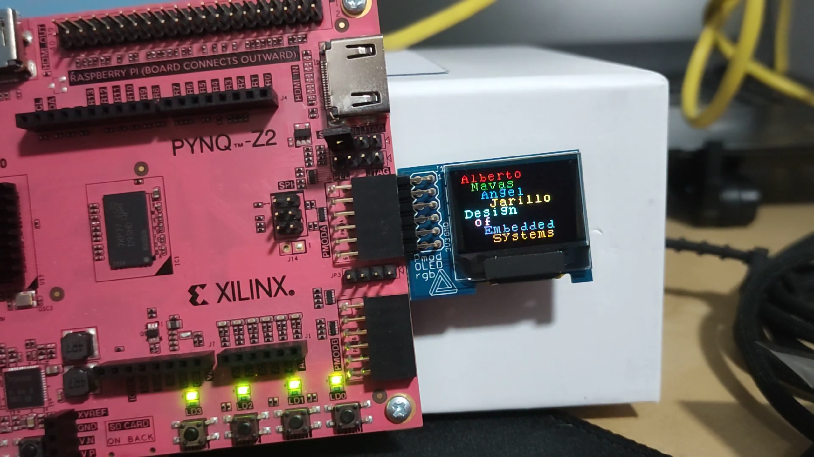
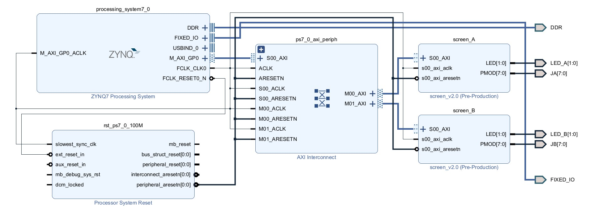

# pmod-oled-rgb

Project for **Design of Embedded Systems**, a subject from my Master's Degree in Industrial Electronics.   

<div align="center">
 
</div>

***

## Contents

- [Requirements]()
- [Project Overview](#project-overview)
- [Design](#design)
    - [The VHDL Block](#the-vhdl-block)
    - [Vivado project: screen](#vivado-project-screen)
    - [Packaging the IP](#packaging-the-ip)
    - [Vivado project: axi_screen](#vivado-project-axi_screen)

***

## Requirements

Vivado: **2024.1**  
Petalinux: **2024.1**  
Board: **PYNQ-Z2**

The Vivado development can be done in Windows or Linux, but Petalinux requires Linux: [Petalinux 2024.1][petalinux-2024.1]

***

## Project Overview


The aim of this project was to design a VHDL block in the PL, package it in an IP, build a hardware platform and control the driver (in the PL) from the PS.

This driver can be controlled from a baremetal application or from an application running in an Operating System.

The system will control the [Pmod OLEDrgb][pmod-oled-rgb] screen via SPI commands.

Here is a little demo video of it working, executing some demo functions, such as the standard provided by the screen
(drawing a full screen of pixels, drawing lines, squares, copy-pasting sections of the screnn) and some custom-built
(showing an image, drawing characters and strings).

[PMOD OLED RGB Demo][youtube-demo]

This was the first version of the project.  

To see the code, go to the folder `old_version`  

Currently I am working on the second version, with some enhacements: add support for a second screen, build the embedded operating system with petalinux, show the FPGA IP address on one of the screens, etc.  
This is the work described now.

## Design

### The VHDL block

The base of this design is the VHDL block, which will later be packaged into an AXI4Lite IP.

The architecture is really simple:

```
└── screen_controller
    └── spi_master
```

The core block is `spi_master`.  

In the first version of the project, I created from scratch an `spi_master` block with a fixed speed (1MHz SCK) and also fixed to work in SPI mode 3.

For this second version, I decided to get an `spi_master` block from [OpenCores][open-cores], which is configurable and much more sofisticated.  
I configured it for SPI mode 3 (required by the Pmod OLED RGB) and used a 6.25MHz SCK (125MHz clk input with 20 clock divider). The maximum SCK allowed by the screen is 6.6MHz.  

```
entity spi_master is
    Generic (   
        N              : positive  := 32;  -- 32bit serial word length is default
        CPOL           : std_logic := '0'; -- SPI mode selection (mode 0 default)
        CPHA           : std_logic := '0'; -- CPOL = clock polarity, CPHA = clock phase.
        PREFETCH       : positive  := 2;   -- prefetch lookahead cycles
        SPI_2X_CLK_DIV : positive  := 5    -- for a 100MHz sclk_i, yields a 10MHz SCK
    );
    Port (  
        sclk_i : in std_logic := 'X'; -- high-speed serial interface system clock
        pclk_i : in std_logic := 'X'; -- high-speed parallel interface system clock
        rst_i  : in std_logic := 'X'; -- reset core
        ---- serial interface ----
        spi_ssel_o : out std_logic;        -- spi bus slave select line
        spi_sck_o  : out std_logic;        -- spi bus sck
        spi_mosi_o : out std_logic;        -- spi bus mosi output
        spi_miso_i : in  std_logic := 'X'; -- spi bus spi_miso_i input
        ---- parallel interface ----
        di_req_o   : out std_logic;                                          -- preload lookahead data request line
        di_i       : in  std_logic_vector (N-1 downto 0) := (others => 'X'); -- parallel data in (clocked on rising spi_clk after last bit)
        wren_i     : in  std_logic := 'X';                                   -- user data write enable, starts transmission when interface is idle
        wr_ack_o   : out std_logic;                                          -- write acknowledge
        do_valid_o : out std_logic;                                          -- do_o data valid signal, valid during one spi_clk rising edge.
        do_o       : out std_logic_vector (N-1 downto 0);                    -- parallel output (clocked on rising spi_clk after last bit)
        done_o     : out std_logic                                           -- handshake added to break continuous tx/rx
        --- debug ports: can be removed or left unconnected for the application circuit ---
        -- sck_ena_o     : out std_logic;                     -- debug: internal sck enable signal
        -- sck_ena_ce_o  : out std_logic;                     -- debug: internal sck clock enable signal
        -- do_transfer_o : out std_logic;                     -- debug: internal transfer driver
        -- wren_o        : out std_logic;                     -- debug: internal state of the wren_i pulse stretcher
        -- rx_bit_reg_o  : out std_logic;                     -- debug: internal rx bit
        -- state_dbg_o   : out std_logic_vector (3 downto 0); -- debug: internal state register
        -- core_clk_o    : out std_logic;
        -- core_n_clk_o  : out std_logic;
        -- core_ce_o     : out std_logic;
        -- core_n_ce_o   : out std_logic
        -- sh_reg_dbg_o  : out std_logic_vector (N-1 downto 0) -- debug: internal shift register
    );                      
end spi_master;
```

<br>

The upper level block is `screen_controller` and behaves as follows:

When putting a `1` in `ON_OFF`, the turning_on sequence is executed (some required steps to correctly start using the Pmod OLED RGB, such as managing `POWER_RESET`, `VCC_ENABLE` and `PMOD_ENABLE`, and sending some SPI commands to set the default settings). More info about this can be found in the [Reference Manual][pmod-oled-rgb-reference-manual].  

`ON_OFF_STATUS` indicates:
- `00` OFF
- `01` Turning ON
- `10` Turning OFF
- `11` ON

When the screen is `ON`, the block bypasses the control signals to the `spi_master` block. In the other states, these control signals are managed internally to execute the aforementioned sequences.  

When `SPI_READY` shows a `1`, we can send a byte through SPI, because there is no SPI transtaction in progress.

To start an SPI transaction:
- Put the 8 bit data in `BYTE`
- Set `DC_SELECT` to `0` (data) or `1` (command)
- Set `SPI_TRIGGER` to `1`

The byte will be sent and the block will request another byte putting a `1` in `SPI_DATA_REQUEST`. This allows for continous data transmit (useful for example to send a lot of pixels to draw an image).  
If no more bytes are sent, the transaction will end and `SPI_READY` will show a `1`.

It is still pending to see if the PS will be fast enough to put another `BYTE`, `DC_SELECT` and `SPI_TRIGGER` when required by `SPI_DATA_REQUEST`. If not, the transactions will be done one by one.  

```
entity screen_controller is
    Port (
        -- Sync
        CLK    : in std_logic;
        RESETN : in std_logic;

        -- Control
        ON_OFF      : in  std_logic;
        SPI_TRIGGER : in  std_logic;

        -- Status
        ON_OFF_STATUS : out std_logic_vector(1 downto 0);
        SPI_READY     : out std_logic;

        -- SPI data request
        SPI_DATA_REQUEST : out std_logic;

        -- Data input
        BYTE      : in  std_logic_vector(7 downto 0);
        DC_SELECT : in  std_logic;

        -- Pmod physical pins
        MOSI         : out std_logic;
        SCK          : out std_logic;
        CS           : out std_logic;
        DATA_COMMAND : out std_logic;
        POWER_RESET  : out std_logic;
        VCC_ENABLE   : out std_logic;
        PMOD_ENABLE  : out std_logic
    );
end screen_controller;
```

***

### Vivado project: screen

To create and test the `screen_controller` block, there is a vivado project called `screen`.  

To replicate the project, open a cmd/terminal in its folder and run the script `build_screen.bat` (Windows) or `build_screen.sh` (Linux).
These scripts will invoke the `generate_vivado_project.tcl` script, that generates the Vivado project, contained in its own folder.  
It is done through the GUI, as for the moment it is not necessary to fully automate all the process, but this can easily be done in the future.

This project has the following hierarchy:

```
└── top
    ├── screen_controller
    │   └── spi_master
    └── screen_tester
```

The behaviour of `screen_controller` is explained above.  

The block `screen_tester` works as follows: if `ON_OFF_STATUS` is ON and `screen_tester` receives a rising edge in  its `ENABLE`, it sends the "ENTIRE_DISPLAY_ON" command, making all the pixels in the screen white.  
If it receives a falling edge in its `ENABLE`, it sends the "ENTIRE_DISPLAY_OFF" command, putting all pixels to black.  

The `top` module instantiates `screen_controller` and `screen_tester` and makes the necessary connections
This way, we have a physical test to see that the commands sent to the screen work.

- SW0: `ON_OFF` of screen_controller
- SW1: `ENABLE` of screen_tester
- LED0: `ON_OFF_STATUS`(0)
- LED1: `ON_OFF_STATUS`(1)
- LED2: `SPI_READY`
- LED3: `ON_OFF`

In this project, there are also testbenches, for the `spi_master`, `screen_controller` and `screen_tester`.
They can be set as top in the simulation folder to be individually executed, and see how each block works.

***

### Packaging the IP

Once I had the VHDL block working and tested, it is the moment to package it in an AXI4Lite IP.
In a Vivado project, in the top bar:  
 - Tools > Create and Package New IP > Create AXI4 Peripheral > [...] > Add IP to repository.

Then, going to the IP Catalog, it can be edited with the IP Packager. It creates a project, where we need to add the user logic blocks (screen_controller and spi_master).

With this IP, I basically connected the control/write ports (ON_OFF, SPI_TRIGGER, BYTE, DC_SELECT) and the status/read ports(ON_OFF_STATUS, SPI_READY, SPI_REQUEST_DATA) to the AXI registers of the IP block.

The outputs of the IP are:
- **PMOD[7:0]** Pmod pins, connected to the OLED display.
- **LED[1:0]** To indicate ON_OFF_STATUS, as descibed before. This will give visual aid when turning on and off the screen.

After this is done, we can re-package the IP and close the temporal project.

**SCREEN IP REGISTER MAP**

- Slave Register 0 (slv_reg0) (WRITE)
    - Bits 31:1  : Reserved
    - Bit 0      : ON_OFF (W) Control signal to turn ON/OFF the screen

- Slave Register 1 (slv_reg1) (READ)
    - Bits 31:2  : Reserved
    - Bits 1:0   : ON_OFF_STATUS (R) Status signal to indicate if the status of the screen is ON/OFF
        - 00: Screen OFF
        - 01: Screen turning ON
        - 10: Screen turning OFF
        - 11: Screen ON

- Slave Register 2 (slv_reg2) (WRITE)
    - Bits 31:10 : Reserved
    - Bit 9      : SPI_TRIGGER (W) Control signal to trigger sending the BYTE to the screen via SPI
    - Bit 8      : DC_SELECT (W) Control signal to select Data/Command for the BYTE to send
        - 0: Data
        - 1: Command
	- Bits 7:0   : BYTE (W) Byte to send to the screen via SPI

- Slave Register 3 (slv_reg3) (READ)
	- Bits 31:2  : Reserved
	- Bit 1      : SPI_DATA_REQUEST (R) Status signal to indicate that the screen_controller is ready to receive a new BYTE to send via SPI
	- Bit 0      : SPI_READY (R) Status signal to indicate that the screen_controller has finished sending the previous BYTE via SPI

***

### Vivado project: axi_screen

To generate what will be the final hardware platform, I created the vivado project `axi_screen`.  

To replicate the project, open a cmd/terminal in its folder and run the script `build_screen.bat` (Windows) or `build_screen.sh` (Linux).
These scripts will invoke the `generate_vivado_project.tcl` script, that generates the Vivado project, contained in its own folder.  
It is done through the GUI, as for the moment it is not necessary to fully automate all the process, but this can easily be done in the future.

This project only has the HDL wrapper of the block diagram from the picture.
T
<br>

<div align="center">
 
</div>

<br>

In the block diagram, we can see the ZYNQ Processing System connected through AXI interface to 2 `screen` IP blocks.  
The physical output ports of the screen IP are the PMOD and 2 LEDs (which show ON_OFF_STATUS).  

We can generate the bitstream and after that export the hardware platform (a file with .xsa extension).
 - Files > Export > Export Hardware > Include Bitstream

To test if this hardware platform works correctly, we can open Vitis (Tools > Launch Vitis IDE).  
We select a workspace or create a new one in a desired folder

> [!TIP]
> It is recommended to use a Vitis workspace with a short path, such as `C:/vitis_ws/` or else we can have some problems when trying to compile the hardware platform or the application

Once we have a Vitis workspace, we create a hardware platform based on the `.xsa` we exported before and compile it.  

Then we create an application project from the templates: Empty Application.  
In `Sources > src` we add the C program `screen_test.c` (available in the repo: `sw/basic_test/baremetal/screen_test.c`).
We can now build it and run it.  
We will see how the LEDs will turn ON (meaning ON_OFF_STATUS from screens A and B are ON "11") and how the screens receive the command "ENTIRE_DISPLAY_ON".

<br>

<div align="center">
 
</div>

<br>

The screens are connected with 6x2 dupont cables because both can't fit directly in the PMOD connectors side by side.

I decided not to create any scripts to replicate the Vitis project, as it is easier than the Vivado projects and its only purpose is to perform a quick test of the hardware platform.  
The further development will be done with the Petalinux OS.

> [!CAUTION]  
> There is a typo in the Makefile created by the Vivado IP packager.  
> This typo doesn't affect the standalone project created by Vitis, but generates an error when building the petalinux OS.  
> The typo needs to be corrected as follows:  
>   ```
>   LIBSOURCES=($wildcard *.c) --> LIBSOURCES=$(wildcard *.c)  
>   OUTS = ($wildcard *.o)     --> OUTS = $(wildcard *.o) 
>   ``` 
> Once this is done, it is necessary to repackage the IP and regenerate the hardware platform.  

***

### Embedded OS: Petalinux

The petalinux project is stored in the repo, and the image can be regenerated executing the script:

    $ ./generate_petalinux_image

The necessary files to boot the OS from an SD card will appear in the dir `os/petalinux_screen/images/linux`.

The SD card has to be formatted with two partitions:
- **Unallocated**. 4MB of preceding space
- **BOOT**. Formatted to fat32, recommended minimum of 500MB.
- **rootfs**. Formated to ext4, take the rest of the space in the SD card.

Once it is formatted (using a tool as `parted` or `gparted`), mount the SD card partitions.
Assuming they have been mounted in `/media/BOOT` and `/media/rootfs`.
For the boot files, copy them into the `BOOT` partition.
For the root file system, extract it into the `rootfs` partition.

    cp images/linux/BOOT.BIN /media/BOOT/
    cp images/linux/image.ub /media/BOOT/
    cp images/linux/boot.scr /media/BOOT/

    sudo tar -xzvf rootfs.tar.gz -C /media/rootfs

The SD is ready to be plugged in the PYNQ-Z2.

Custom details applied to Petalinux:

- **EXT4 rootfs**. Same as INITRD (default) root file system, requires to be extracted into the SD before the first boot up, but is permanent between reboots.
- Fixed MAC address and let IP address get automatically assigned.
- Added libstdc++ to support C++ applications.

### Embedded SW

Once the Petalinux OS is up and running, the C/C++ software can be compiled, loaded and executed.

In principle, petalinux provides a custom toolchain, than can be generated and extracted with the following commands:

    $ petalinux-build --sdk
    $ petalinux-package sysroot

This is sometimes unpredictable and gets stuck on the process, so I proceeded with the standard Arm cross-compiler toolchain for 32 bit architecture: `AArch32 GNU/Linux target with hard float (arm-none-linux-gnueabihf)`.  
Version: `14.3.Rel1 (July 03, 2025)`  
Available here: [Arm GNU Toolchain Downloads][arm-toolchain]

Download it and extract it in the `os/` directory:

    $ tar -xvf arm-gnu-toolchain-14.3.rel1-x86_64-arm-none-linux-gnueabihf.tar.xz

In the folder `sw/basic_test/linux` there are two versions of the same program (C and C++) to test the screen. They can be compiled and sent to the PYNQ-Z2 board using the script:

    $ ./compile_and_send.sh

> [!TIP]  
> The script `compile_and_send.sh` sends the binaries to `pynqz2-screen:/home/petalinux`.  
> This means there has to be a host alias in `.ssh/config` with its IP and user (petalinux).

Connect to the board via SSH and execute them (with sudo privileges to open `/dev/mem`):

    $ sudo ./screen_test_c
    $ sudo ./screen_test_cpp

[comment]: (Links)
[petalinux-2024.1]: https://docs.amd.com/r/2024.1-English/ug1144-petalinux-tools-reference-guide
[pmod-oled-rgb]: https://digilent.com/reference/pmod/pmodoledrgb/start
[youtube-demo]: https://youtu.be/TNlVlC1Tnaw
[open-cores]: https://opencores.org/
[pmod-oled-rgb-reference-manual]: https://digilent.com/reference/pmod/pmodoledrgb/reference-manual
[arm-toolchain]: https://developer.arm.com/downloads/-/arm-gnu-toolchain-downloads
